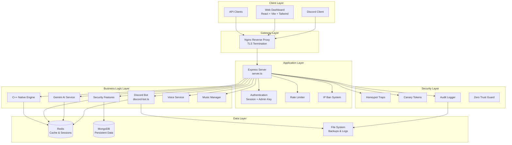
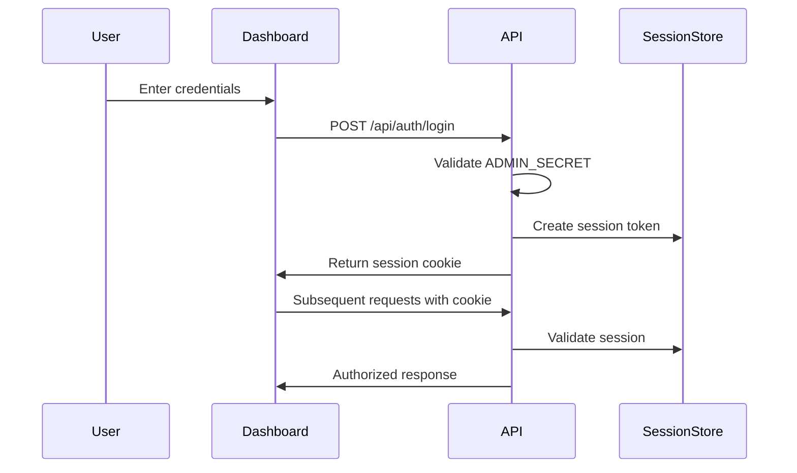
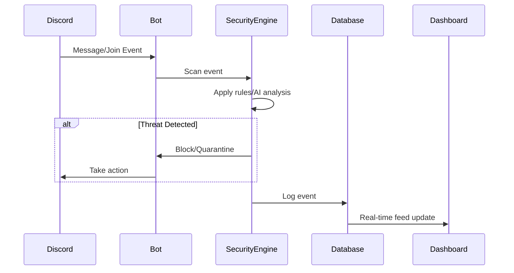

# Architecture Documentation

## System Overview



## Component Relationships

### Express Server (`server.ts`)
- Central orchestrator for all API endpoints
- Handles authentication, rate limiting, and security middleware
- Serves React frontend in production via Vite middleware
- Manages Discord bot lifecycle

### Discord Bot (`discord-bot.ts`)
- Handles Discord gateway connection and events
- Implements security features (anti-raid, anti-scam)
- Manages slash commands and interactions
- Communicates with external APIs (Gemini, GitHub)

### C++ Native Engine (`src/CppEngine.ts`)
- High-performance packet scanning
- Cryptographic operations
- Security metrics calculation
- WASM-compatible architecture

### React Dashboard (`src/App.tsx`)
- Single-page application with tabbed navigation
- Real-time updates via polling
- Admin authentication via session cookies
- Responsive design with Tailwind CSS

## Data Flow

### Authentication Flow


### Security Event Flow


## C++ Engine Architecture

The C++ native engine provides high-performance security operations:

```
┌─────────────────────────────────────┐
│         C++ Native Engine           │
├─────────────────────────────────────┤
│  ┌─────────────┐  ┌──────────────┐ │
│  │ Packet      │  │ Cryptographic │ │
│  │ Scanner     │  │ Operations    │ │
│  └─────────────┘  └──────────────┘ │
│  ┌─────────────┐  ┌──────────────┐ │
│  │ Metrics     │  │ Memory       │ │
│  │ Collector   │  │ Manager      │ │
│  └─────────────┘  └──────────────┘ │
└─────────────────────────────────────┘
```

- **Packet Scanner**: Analyzes Discord gateway packets in real-time
- **Cryptographic Operations**: Hash verification, token validation
- **Metrics Collector**: Performance and security metrics aggregation
- **Memory Manager**: Efficient buffer management for high-throughput scenarios

## Security Pipeline Architecture

```
┌──────────┐    ┌──────────┐    ┌──────────┐    ┌──────────┐
│ Ingest   │ -> │ Filter  │ -> │ Analyze │ -> │ Act     │
│ Layer    │    │ Layer   │    │ Layer   │    │ Layer   │
└──────────┘    └──────────┘    └──────────┘    └──────────┘
     │               │               │               │
     v               v               v               v
  Raw Events     Rate Limit    AI/Pattern    Block/Quarantine/
  IP Tracking    IP Ban        Scoring       Log/Notify
```

## Dashboard Architecture

```
┌──────────────────────────────────────────────────────────┐
│                    Dashboard (App.tsx)                    │
├──────────────────────────────────────────────────────────┤
│  ┌─────────────┐  ┌─────────────┐  ┌─────────────────┐  │
│  │ Navigation  │  │ Content     │  │ State           │  │
│  │ Sidebar     │  │ Canvas      │  │ Management      │  │
│  └─────────────┘  └─────────────┘  └─────────────────┘  │
│         │                  │                    │        │
│         v                  v                    v        │
│  ┌──────────────────────────────────────────────────┐    │
│  │              Tab Components                       │    │
│  │  Overview | Security | Analytics | Monitoring... │    │
│  └──────────────────────────────────────────────────┘    │
└──────────────────────────────────────────────────────────┘
```

### State Management
- Local component state with React hooks
- Periodic polling for real-time data (5s intervals)
- Event-driven updates for security events
- Session-based authentication

## Deployment Architecture

```
┌───────────────────────────────────────────────────────────────┐
│                        Production Stack                        │
├───────────────────────────────────────────────────────────────┤
│  ┌─────────────┐     ┌─────────────┐     ┌─────────────────┐  │
│  │   Nginx     │────▶│   Docker    │────▶│   PM2 /         │  │
│  │   Proxy     │     │   Compose   │     │   Systemd       │  │
│  └─────────────┘     └─────────────┘     └─────────────────┘  │
│         │                    │                    │           │
│         v                    v                    v           │
│  ┌─────────────┐     ┌─────────────┐     ┌─────────────────┐  │
│  │   TLS       │     │   Redis     │     │   Application   │  │
│  │   Cert      │     │   Cache     │     │   Instance      │  │
│  └─────────────┘     └─────────────┘     └─────────────────┘  │
└───────────────────────────────────────────────────────────────┘
```

## Scalability Considerations

### Horizontal Scaling
- Stateless API servers can be scaled behind load balancer
- Redis for shared session state
- MongoDB for persistent data
- WebSocket connections require sticky sessions

### Performance Optimization
- C++ engine for CPU-intensive operations
- Connection pooling for database
- Response caching in Redis
- Compression for API responses
- Static asset optimization via Vite

## Monitoring & Observability

- Health check endpoint at `/api/health`
- Structured JSON logging
- Audit trail for all admin actions
- Real-time metrics in dashboard
- Error tracking with categorization
