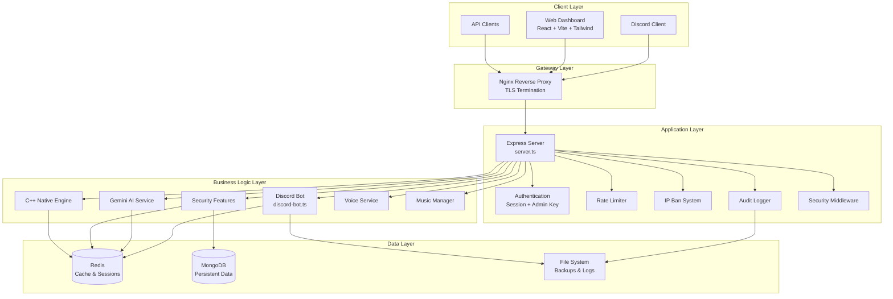
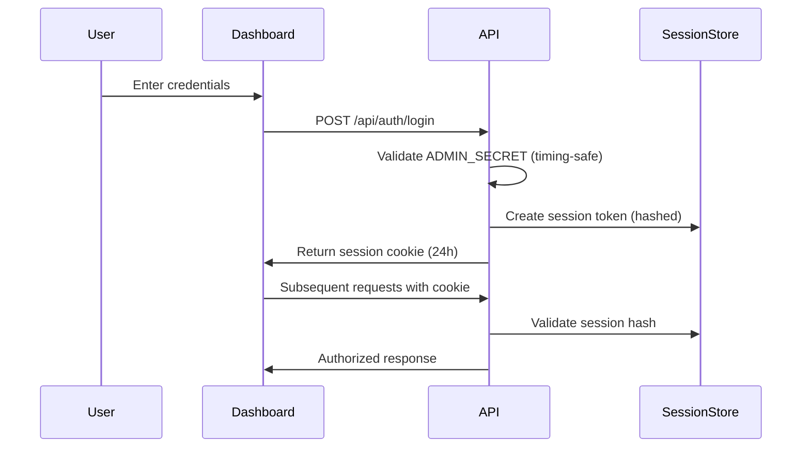
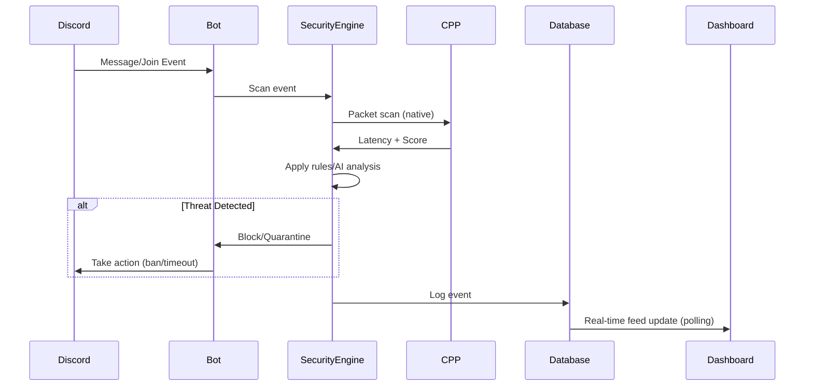
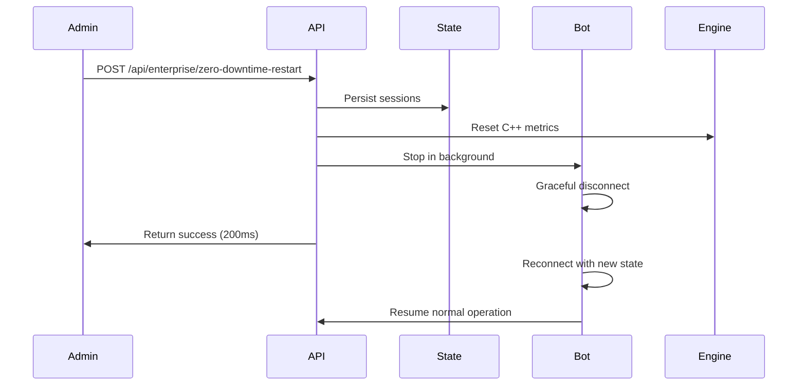

# Architecture Documentation

## System Overview



## Component Descriptions

### Client Layer

#### Web Dashboard (`src/App.tsx`)
- **Technology**: React 19 + Vite 6 + Tailwind CSS 4 + Motion
- **Purpose**: Single-page admin dashboard for server management
- **Features**:
  - Real-time security event monitoring
  - Attack timeline visualization
  - Risk score gauges with historical trends
  - System health metrics (CPU, RAM, disk, network)
  - Audit log viewer with CSV/JSON export
  - Music player controls
  - GitHub integration panel
  - Settings and configuration tabs

#### Discord Client
- **Purpose**: User interaction with the Discord API
- **Integration**: Connects via Discord.js v14 gateway
- **Events**: Messages, joins, reactions, voice states

### Application Layer

#### Express Server (`server.ts`)
- **Framework**: Express 4.21 + Helmet + CORS + Rate Limiting
- **Port**: Configurable via `PORT` env var (default: 3000)
- **Key Responsibilities**:
  - API endpoint routing for 50+ endpoints
  - Authentication middleware with timing-safe comparisons
  - Sliding window rate limiting per IP
  - IP ban enforcement middleware
  - GitHub webhook signature verification
  - C++ engine API exposure
  - React frontend serving in production

#### Authentication (`requireAdminAuth`)
- **Methods**:
  1. Direct `ADMIN_SECRET` comparison (timing-safe)
  2. Session token validation (24h expiry, hashed storage)
  3. Cookie-based sessions (`admin_session_token`)
- **Security**: `crypto.timingSafeEqual` for constant-time comparison
- **Replay Protection**: Token hash stored server-side, 5s window check

#### Rate Limiting (`RateLimiterMiddleware`)
- **Global**: 150 requests per 15 minutes per IP
- **AI Endpoints**: 10 requests per minute
- **Heavy Operations**: 5 requests per 5 minutes
- **Login**: 10 requests per minute
- **Implementation**: Sliding window with in-memory Map

#### IP Ban System (`IPBanSystem`)
- **Storage**: File-backed (`ip_bans.json`) with Redis cache
- **Normalization**: IPv4/IPv6 mapping (strips `::ffff:` prefix)
- **Application**: Ultra-fast middleware before all routes
- **Persistence**: Atomic writes with 0600 permissions

#### Audit Logger (`logAdminAuditAction`)
- **Storage**: `admin_audit.json` (max 500 records)
- **Fields**: timestamp, action, actorIp, details
- **Format**: Structured JSON with secret redaction
- **Retention**: FIFO eviction at 500 entries

### Business Logic Layer

#### Discord Bot (`discord-bot.ts`)
- **Framework**: Discord.js v14 with Gateway Intents
- **Sharding**: Single shard, extensible to multi-shard
- **Key Features**:
  - Anti-raid and anti-nuke protection
  - Auto-moderation with AI analysis
  - Slash command handling
  - Voice channel management
  - Ticket system
  - Verification system
  - Economy/leaderboard

#### Gemini AI Service
- **Model**: `gemini-2.5-flash`
- **Features**:
  - Search grounding via `googleSearch` tool
  - Retry logic with exponential backoff (3 retries)
  - 15s timeout per request
  - System prompt with 6 operational modes:
    1. RAID_DREAM - Raid risk prediction
    2. CODE_DOCTOR - Bug fixing
    3. VC_GOD - Voice chat moderation
    4. SALES_CLOSER - Revenue optimization
    5. VIRAL_CONTENT - Engagement ideas
    6. AI_JUDGE - Dispute resolution

#### Security Features (`src/SecurityFeatures.ts`)
- **TokenVault**: AES-256-GCM encrypted token storage with PBKDF2 key derivation
- **BehaviorScoring**: Risk scoring for Discord users
- **HoneypotAdminRole**: Decoy roles for trap detection
- **SessionHijackDetector**: Anomaly detection for session tokens
- **OAuthMaliciousAppDetector**: Scans guild OAuth integrations
- **BotTokenRotationSystem**: Automatic Discord token rotation
- **AutoPermissionRollback**: Reverts dangerous permission changes
- **ServerSnapshotRestore**: 1-click server state restoration
- **AntiVanityHijack**: Protects vanity URL changes
- **EmojiStickerProtection**: Prevents emoji/sticker abuse
- **ForumChannelProtection**: Guards forum configurations
- **AIRaidPrediction**: ML-based raid risk forecasting
- **AISecurityReport**: Automated security report generation
- **AICommandAssistant**: Natural language command processing
- **MongoRedisEngine**: Database connection management
- **PremiumLicenseSystem**: Hardware-fingerprinted license validation
- **IPBanSystem**: Persistent IP banning
- **EnvScanner**: Environment variable validation
- **RateLimiter**: Redis-backed distributed rate limiting
- **CanaryToken**: Breach detection via decoy tokens
- **AdminWhitelistSystem**: IP/User whitelist management

#### C++ Native Engine (`src/CppEngine.ts`)
- **Purpose**: High-performance security packet scanning
- **Modes** (priority order):
  1. Native C++ module (`security_engine.node`) via N-API
  2. Worker Thread engine (parallel processing)
  3. Sync fallback (main thread, ArrayBuffer-based)
- **Operations**:
  - Packet scanning with latency measurement
  - Cryptographic hashing (SHA-256, SHA-512, CRC32)
  - Metrics collection and reporting
- **Fallback Strategy**: Automatic degradation on native/worker failure

#### Voice Service (`src/services/VoiceService.ts`)
- **Library**: @discordjs/voice + prism-media
- **Features**: Play, pause, resume, stop, volume, seek
- **Stream Sources**: play-dl for YouTube/Spotify URLs

#### Music Manager (`src/services/MusicManager.ts`)
- **State**: Per-guild queue management
- **Features**: Queue, shuffle, equalizer, history
- **Persistence**: In-memory with file backup

### Data Layer

#### Redis
- **Purpose**: Session cache, rate limiting, temporary data
- **Connection**: Managed by `MongoRedisEngine`
- **Usage**: IP ban cache, session store, rate limit counters

#### MongoDB
- **Purpose**: Persistent data storage
- **Connection**: Managed by `MongoRedisEngine`
- **Usage**: User data, audit logs, configuration

#### File System
- **Backups**: `backups/` directory with atomic writes
- **Snapshots**: `snapshots/` for server state
- **Logs**: `logs/` directory for persistent logging
- **Vault**: `vault_tokens.json`, `vault_salt.txt` for encrypted storage
- **Sessions**: `admin_sessions.json` for session persistence

## Data Flow

### Authentication Flow



### Security Event Flow



### Zero-Downtime Restart Flow



## C++ Engine Architecture

```
┌─────────────────────────────────────────────────────────────────┐
│                    C++ Native Engine (N-API)                     │
├─────────────────────────────────────────────────────────────────┤
│  ┌─────────────┐  ┌──────────────┐  ┌────────────────────────┐ │
│  │ Packet      │  │ Cryptographic│  │ Memory                 │ │
│  │ Scanner     │  │ Operations   │  │ Manager                │ │
│  │             │  │              │  │ (Arena Allocator)      │ │
│  │ - ScanBatch │  │ - SHA-256    │  │ - 16 MiB bump buffer   │ │
│  │ - ScanPacket│  │ - SHA-512    │  │ - Cache-line aligned   │ │
│  │             │  │ - CRC-32     │  │ - O(1) reset           │ │
│  └─────────────┘  └──────────────┘  └────────────────────────┘ │
│  ┌─────────────┐  ┌──────────────┐  ┌────────────────────────┐ │
│  │ Metrics     │  │ Latency      │  │ Decision                │ │
│  │ Collector   │  │ Tracker      │  │ Engine                  │ │
│  │             │  │              │  │ (PASS/FLAG/BLOCK)       │ │
│  │ - Atomic    │  │ - Ring buf   │  │ - Risk scoring          │ │
│  │ - Throughput│  │ - Percentile │  │ - Threshold rules       │ │
│  └─────────────┘  └──────────────┘  └────────────────────────┘ │
└─────────────────────────────────────────────────────────────────┘
                              │
                              │ N-API Bridge
                              ▼
┌─────────────────────────────────────────────────────────────────┐
│                    TypeScript Layer (CppEngine.ts)               │
│  - Priority-based mode selection (native > worker > sync)       │
│  - Fallback logic with automatic degradation                    │
│  - Promise-based async interface                                │
└─────────────────────────────────────────────────────────────────┘
```

### Engine Modes

| Mode | Description | Performance | Availability |
|------|-------------|-------------|--------------|
| Native | N-API C++ module | ~0.3-0.8ms latency | Requires build |
| Worker | Worker thread engine | ~1-5ms latency | Always available |
| Sync | Main thread fallback | ~5-20ms latency | Always available |

## Security Pipeline Architecture

```
┌──────────┐    ┌──────────┐    ┌──────────┐    ┌──────────┐
│ Ingest   │ -> │ Filter  │ -> │ Analyze │ -> │ Act     │
│ Layer    │    │ Layer   │    │ Layer   │    │ Layer   │
└──────────┘    └──────────┘    └──────────┘    └──────────┘
     │               │               │               │
     v               v               v               v
┌──────────┐   ┌──────────┐   ┌──────────┐   ┌──────────┐
│ Raw      │   │ Rate      │   │ AI/      │   │ Block/   │
│ Events   │   │ Limit     │   │ Pattern  │   │ Quarantine│
│ IP Track │   │ IP Ban    │   │ Score    │   │ Log/Notify│
└──────────┘   └──────────┘   └──────────┘   └──────────┘
```

### Pipeline Stages

1. **Ingest Layer**: Raw events from Discord gateway, webhooks, API
2. **Filter Layer**: Rate limiting, IP banning, replay protection
3. **Analyze Layer**: C++ engine scanning, AI scoring, pattern matching
4. **Act Layer**: Automated moderation, quarantine, notifications

## Scalability Considerations

### Horizontal Scaling
- Stateless API servers behind load balancer
- Redis for shared session and rate limit state
- MongoDB for persistent data
- HTTP polling connections require no sticky sessions
- C++ engine metrics aggregated per instance

### Performance Optimization
- C++ engine for CPU-intensive operations
- Connection pooling for database
- Response caching in Redis (5min TTL static, 30s dynamic)
- Compression for API responses (gzip/deflate)
- Static asset optimization via Vite
- Worker threads for parallel processing

### Resource Requirements

| Component | Minimum | Recommended |
|-----------|---------|-------------|
| RAM | 512MB | 2GB |
| CPU | 1 core | 2+ cores |
| Disk | 1GB | 10GB SSD |
| Network | 10Mbps | 100Mbps |

## Monitoring & Observability

- Health check endpoint at `/api/health`
- Structured JSON logging with secret redaction
- Audit trail for all admin actions
- Real-time metrics in dashboard (5s polling)
- Error tracking with severity categorization
- C++ engine latency tracking (p50/p95/p99)
- Detection latency analysis
- Event throughput monitoring
