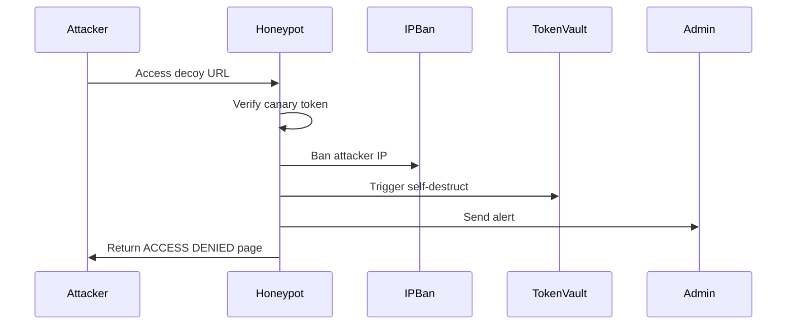

# Security Model Documentation

## Zero-Trust Architecture

This system operates on a **zero-trust security model**: no entity (user, service, or network) is trusted by default, even if already inside the network perimeter.

### Core Principles

1. **Never Trust, Always Verify**: Every request is authenticated and authorized
2. **Least Privilege Access**: Minimal permissions for all components
3. **Assume Breach**: Design assumes threats exist both inside and outside
4. **Explicit Verification**: Multi-factor authentication and continuous validation
5. **Data Protection**: Encryption at rest and in transit

## Detection Pipeline

### Pipeline Architecture

```
┌──────────┐    ┌──────────┐    ┌──────────┐    ┌──────────┐
│ Ingest   │ -> │ Filter  │ -> │ Analyze │ -> │ Act     │
│ Layer    │    │ Layer   │    │ Layer   │    │ Layer   │
└──────────┘    └──────────┘    └──────────┘    └──────────┘
     │               │               │               │
     v               v               v               v
┌──────────┐   ┌──────────┐   ┌──────────┐   ┌──────────┐
│ Raw      │   │ Rate      │   │ AI/      │   │ Block/   │
│ Events   │   │ Limit     │   │ Pattern  │   │ Quarantine│
│ IP Track │   │ IP Ban    │   │ Score    │   │ Log/Notify│
└──────────┘   └──────────┘   └──────────┘   └──────────┘
```

### Stage 1: Ingest Layer

**Input Sources:**
- Discord gateway events (messages, joins, reactions)
- Webhook payloads (GitHub, external integrations)
- API requests (dashboard, admin actions)
- Discord interaction events (buttons, modals, slash commands)

**Processing:**
- IP extraction and normalization (`::ffff:` prefix stripping)
- User ID extraction from Discord context
- Timestamp generation with microsecond precision
- Event type classification

### Stage 2: Filter Layer

**Filters Applied:**

1. **IP Ban Check**
   - Ultra-fast middleware before all routes
   - File-backed (`ip_bans.json`) with Redis cache
   - Normalized IP matching
   - Automatic ban on honeypot trap activation

2. **Rate Limiting**
   - Sliding window implementation
   - Per-IP tracking with in-memory Map
   - Configurable windows and limits
   - Backoff on repeated violations

3. **Replay Protection**
   - 5-second token nonce window
   - Server-side token hash storage
   - Automatic pruning of old entries

4. **CORS Validation**
   - Strict origin policy
   - Credential-aware configuration
   - Development vs production modes

### Stage 3: Analyze Layer

**Analysis Engines:**

1. **C++ Native Engine**
   - Packet scanning with sub-millisecond latency
   - Risk scoring based on weight multipliers
   - Cryptographic integrity checks

2. **AI Analysis (Gemini)**
   - 6 operational modes for different scenarios
   - Search grounding for threat intelligence
   - Sentiment analysis for message content
   - Pattern recognition for raid detection

3. **Rule Engine**
   - Mass join velocity detection
   - Permission escalation monitoring
   - Vanity URL hijack detection
   - Emoji/sticker abuse detection
   - Forum channel manipulation detection

4. **Behavioral Analysis**
   - User risk scoring
   - Anomaly detection
   - Historical pattern comparison

### Stage 4: Act Layer

**Actions Taken:**

1. **Automated Moderation**
   - Message deletion
   - User timeout/ban
   - Role removal
   - Channel lockdown

2. **Quarantine**
   - User flagging
   - Content isolation
   - Review queue placement

3. **Notification**
   - Admin alerts via Discord webhooks
   - Audit log entry creation
   - Dashboard event feed update

4. **Escalation**
   - Lockdown mode activation
   - Token rotation trigger
   - Server snapshot creation

## Rule Engine

### Built-in Rules

| Rule | Trigger | Action | Severity |
|------|---------|--------|----------|
| MassJoin | >10 joins/minute | Auto-ban + lockdown | Critical |
| PermissionEscalation | Admin role grant to non-admin | Auto-revert + alert | Critical |
| VanityHijack | URL change without auth | Revert + ban | High |
| EmojiSpam | >20 emoji messages/minute | Timeout + rate limit | Medium |
| StickerAbuse | Sticker in restricted channel | Delete + warn | Low |
| ForumManipulation | Channel type change | Revert + audit | High |
| ScamDetection | Known scam patterns | Delete + ban | Critical |
| RaidPrediction | AI confidence >80% | Pre-lockdown | Critical |

### Rule Configuration

Rules are configurable via:
- `CONFIG.md` environment variables
- Dashboard settings panel
- Runtime API endpoints

## Decision Matrix

### Threat Level Classification

| Level | Score Range | Color | Response Time | Auto-Action |
|-------|-------------|-------|---------------|-------------|
| Low | 0-25 | Green | 5 minutes | Log only |
| Medium | 26-50 | Yellow | 1 minute | Warn + monitor |
| High | 51-75 | Orange | 30 seconds | Timeout + alert |
| Critical | 76-100 | Red | Immediate | Ban + lockdown |

### Decision Factors

```
Score = (BaseRisk * Weight) + (Velocity * Multiplier) + (AI_Confidence * 0.3) + (History * 0.2)
```

**Factors:**
- **BaseRisk**: Inherent risk of the action type
- **Velocity**: Rate of events (events per minute)
- **AI_Confidence**: Gemini model confidence (0-100)
- **History**: Past offenses by the user

## Lockdown Procedures

### Automatic Lockdown

**Triggers:**
- Critical threat detection
- Raid prediction confidence >80%
- Multiple simultaneous alerts
- Canary token activation

**Actions:**
1. Set `LOCKDOWN=true` in state
2. Disable `@everyone` permissions
3. Enable verification level
4. Log all events during lockdown
5. Notify admins via Discord

### Manual Lockdown

**Endpoint:** `POST /api/bot/lockdown`

**Process:**
1. Admin authentication check
2. Audit log entry creation
3. Discord permission update
4. State persistence
5. Dashboard notification

### Lockdown Recovery

**Steps:**
1. Verify threat has passed
2. Review audit logs
3. Restore permissions
4. Re-enable normal operations
5. Generate security report

## Canary Token System

### Purpose

Decoy tokens that trigger immediate security responses when used.

### Implementation

```typescript
class CanaryToken {
  static check(token: string): boolean {
    // Check against known canary values
  }
  
  static verifySignedToken(token: string): VerificationResult {
    // HMAC verification
  }
  
  static setup(): void {
    // Initialize canary values
  }
}
```

### Deployment

- Embedded in honeypot URLs
- Placed in configuration files
- Distributed in documentation
- Used in API parameter validation

### Response

On canary token detection:
1. IP ban immediate
2. User ban (if Discord ID known)
3. Token vault self-destruct
4. Audit log entry
5. Admin notification

## Honeypot System

### Trap Types

1. **URL Traps**: `/trap/:guildId/:userId`
2. **API Traps**: `/api/honeypot-trap`
3. **Parameter Traps**: Fake API parameters

### Trap Activation



### Trap Response

- Immediate IP ban
- User Discord ID extraction and ban
- All secrets wiped from memory
- Audit trail created
- Admin notification sent

## Session Security

### Session Lifecycle

1. **Creation**: `crypto.randomBytes(32)` → hex token
2. **Storage**: SHA-256 hash stored in `admin_sessions.json`
3. **Validation**: Hash lookup in active sessions Map
4. **Expiry**: 24-hour TTL with automatic cleanup
5. **Revocation**: Explicit deletion from Map + disk sync

### Replay Protection

- 5-second window for token reuse detection
- Server-side nonce tracking
- Automatic pruning of old entries (5 minutes)

### Secret Comparison

```typescript
crypto.timingSafeEqual(Buffer.from(token), Buffer.from(ADMIN_SECRET))
```

Prevents timing attacks on secret comparison.

## Secret Management

### Storage

- **Environment Variables**: Primary method
- **TokenVault**: AES-256-GCM encrypted file storage
- **Key Derivation**: PBKDF2 with 100,000 iterations

### Redaction

All secrets are redacted in logs:
- GitHub PATs (`ghp_***`)
- Gemini API keys (`AIzaSy***`)
- Discord tokens (`[DISCORD_TOKEN_REDACTED]`)
- Admin keys (`***REDACTED***`)

### Rotation

- **Discord Bot Token**: Via `BotTokenRotationSystem`
- **Admin Secret**: Manual rotation with session invalidation
- **GitHub Token**: Via dashboard save endpoint

## IP Ban System

### Storage

- **Primary**: `ip_bans.json` (file-backed)
- **Cache**: Redis (when available)
- **Format**: `{ ipAddress, reason, timestamp, bannedBy }`

### Application

- Middleware runs before all routes
- IP normalization (IPv4/IPv6)
- Atomic write operations
- Automatic reload on startup

### Auto-Ban Triggers

- Honeypot trap activation
- Rate limit exhaustion
- Failed auth attempts (>10/minute)

## Audit Trail

### Structure

```json
{
  "timestamp": "2026-08-12T13:37:54.000Z",
  "action": "ADMIN_LOGIN",
  "actorIp": "127.0.0.1",
  "details": {
    "username": "Admin",
    "authMode": "admin-secret"
  }
}
```

### Properties

- Immutable append-only structure
- Atomic file writes with `fsync`
- Max 500 entries (FIFO eviction)
- Structured JSON format
- Secret redaction in details

## Backup Integrity

### Verification

- CRC-32 checksums for all backup files
- Atomic write operations
- Integrity test endpoint: `POST /api/admin/backup-integrity-test`

### Storage

- `backups/` directory with timestamped files
- 0600 file permissions
- Exclusion from source archives
